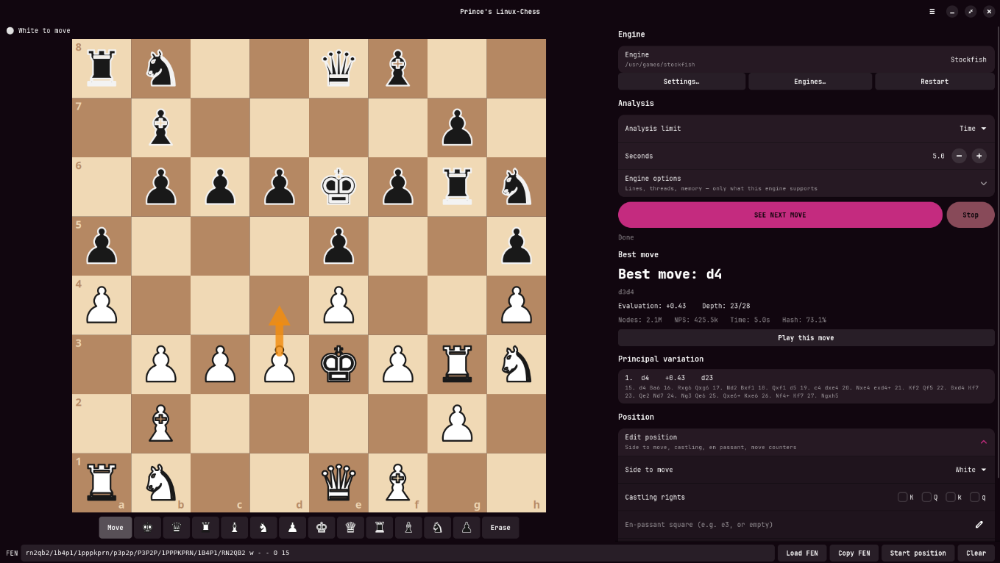
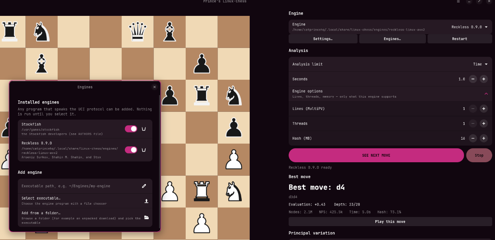

<p align="center">
  
</p>

# Prince's Linux-Chess

You want to play chess against a bot, locally, on your Linux machine? Well I ran into an issue trying to do exactly this. They all used wine or just completely broke. So i made my own. No browser, no account, no internet connection. Makes it all easy. Talks to any UCI chess engine thats installed and chmodded on your desktop (as long as you open it up in the app, for stockfish I don't even think you need to open it). It roughly emulates the experience of
[chess-bot.com](https://chess-bot.com/), but runs offline, with performance in mind and a
download of under one megabyte.

**Developer:** CatPrinceHQ · **License:** GPL-3.0-or-later · **Platform:** Ubuntu / Debian (amd64)

---

## Screenshots





---

## Features

- **Interactive board:** You drag around pieces or click for the legal move dots, with last-move, check and selection highlights, board flipping and coordinates. Basically like Chess.com analysis. I sort of copied how they did it quite a bit actually.
- **Play against any UCI engine:** press **See next move** (`Ctrl+Enter`) to get the bot's reply, then **Play this move** to put it on the board. `Esc` quits a search.
- **Choose your opponent:** add any UCI engine executable. New engines work without issue. Tested with a few engines. I can't say it for every engine but it should be fine.
- **Tune the bot:** engine options (Threads, Hash, MultiPV, Nodes, Time, Depth) appear in the settings if the bot supports those settings. Real simple.
- **Eval info:** The eval info comes from the bot that you are using so it can be inaccurate. Unless you're playing maxed out Stockfish. Then it's about right.
- **Full FEN support:** Mess with any imported position with validation to make sure you don't chuck something impossible in there and crash the thing.
- **Never freezes:** Can't actually prove this one either but engines run in the background so crashes and crap errors should just tell you rather than hanging up the whole thing.
- **Fully offline and local:** nothing leaves your machine. Unless you share it yourself somehow. But that's not a part of this program.

## I dont give a $#!T !! Let me try it myself!

Alright buddy. I hear you. It requires Ubuntu 24.04 or later (or another Debian-based system with GTK 4.10+ and
libadwaita 1.4+).

```sh
git clone https://github.com/CatPrinceHQ2/Linux-Chess.git && cd Linux-Chess
sudo apt install ./linux-chess_0.1.2_amd64.deb
sudo apt install stockfish        # recommended: a ready-to-use bot
```

Then just select and open **Prince's Linux-Chess** from your app menu! Or if you are a terminal guy run `linux-chess`... stinky. Just kidding- we love you, terminal guys. The app finds Stockfish automatically if you got it. To use another engine, open the menu → **Engines…** and select its executable. Should work fine, as stated earlier.

## Build from source

```sh
git clone https://github.com/CatPrinceHQ2/Linux-Chess.git && cd Linux-Chess
sudo apt install build-essential pkg-config libgtk-4-dev libadwaita-1-dev curl
curl --proto '=https' --tlsv1.2 -sSf https://sh.rustup.rs | sh -s -- -y
. "$HOME/.cargo/env"
cargo build --release
./target/release/linux-chess
```

## Engines and licenses (Legal speak, wompwomp..)

Engines are separate programs with their own licenses, and they are never part of this app's
license. Copies of the licenses for this app and for the engines listed below are in
[`licenses/`](licenses/).

| Engine | License | Source |
|---|---|---|
| Berserk | GPL-3.0 | https://github.com/jhonnold/berserk |
| Obsidian | GPL-3.0 | https://github.com/gab8192/Obsidian |
| pawnocchio | GPL-3.0 | https://github.com/JonathanHallstrom/pawnocchio |
| PlentyChess | GPL-3.0 | https://github.com/Yoshie2000/PlentyChess |
| Reckless | AGPL-3.0 | https://github.com/codedeliveryservice/Reckless |

## License

Prince's Linux-Chess is released under the GNU General Public License v3.0 or later.
See [`licenses/LICENSE-linux-chess-GPL-3.0`](licenses/LICENSE-linux-chess-GPL-3.0).
